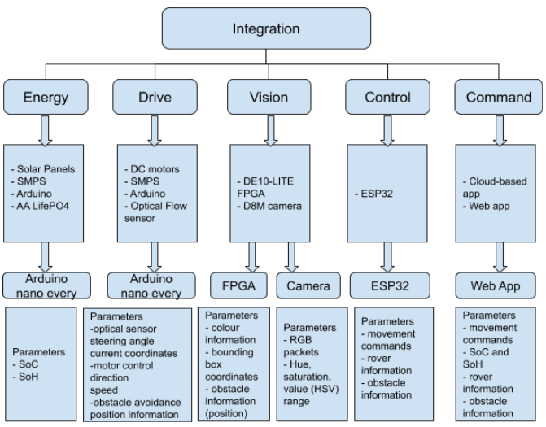
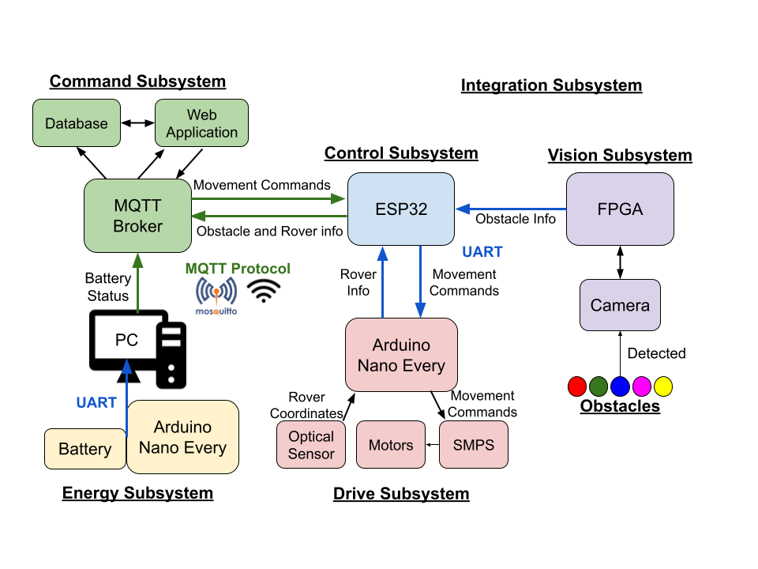
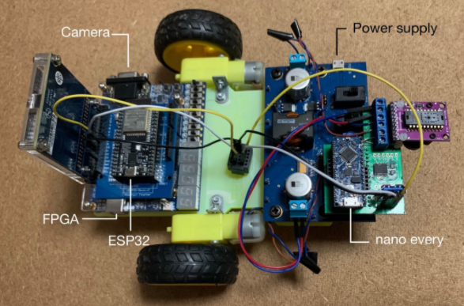
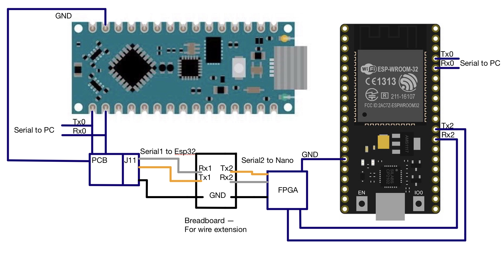

# Mars Rover System - Group 25

This project implements a Mars Rover system consisting of 6 subsystems - Integration, Energy, Drive, Vision, Command and Control. The Mars Rover is capable of autonomously traversing and mapping out a remote location through remote control without the need for direct supervision. It is also able to detect, avoid, and map out obstacles encountered. Additionally, self charging capability was implemented.

## Structural Design
The following diagram illustrates the Structural Design of the Mars rover system.
 

## Functional Design
The following diagram illustrates the Functional Design of the Mars rover system.
 

## Physical Implementation
The following diagram shows the physical implementation of the actual Mars Rover system.
 

# How to Use the Mars Rover system:
1. Plug in the ESP32 onto the FPGA.
2. Connect the ESP32 to the Arduino Nano Every on the Drive subsystem as following in the diagram below.

 

3. Ensure that all the different devices are connected to your computer via the appropriate cables for programminng.
4. To set up the Command subsystem, follow the instructions as seen in the _Command_ folder.
5. To set up the Control subsystem, follow the instructions as seen in the _Control_ folder.
6. To set up the Vision subsystem, follow the instructions as seen in the _Vision_ folder.
7. To set up the Drive subsystem, follow the instructions as seen in the _Drive_ folder.
8. The Energy subsystem cannot be physically implemented, please refer to the _Energy_ folder for further details on how it is integrated with the Mars Rover system.
9. The Mars Rover system is now capable of taking in movement commands from the Command subsystem, and capable of obstacle detection and avoidance, and terrain mapping.

For further details, please refer to the Report and Video.

